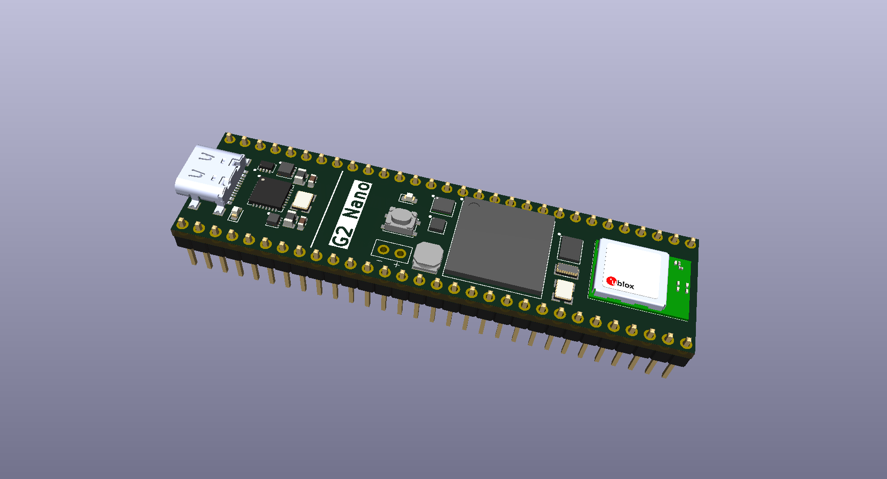

# G2 Nano Development Board
This repository houses the KiCad source files for the G2 Nano microcontroller development board.

The G2 Nano is a high-performance microcontroller development board combining a 1 GHz Arm Cortex-M7 processor with dual-band Wi-Fi, a 9-axis inertial measurement unit, and an on-board closed-loop motion controller.

## Overview
* This PCB was designed using KiCad 10 and it's standard library of footprints, symbols, and models.

* The KiCad project is contained within the `kicad/` directory and can be opened via the `kicad/DEV-G2-NANO.kicad_pro` file.

* All custom footprints, symbols, and models are located in the `kicad/project_lib/` directory. The same directory houses the schematic page template.

## Features
* 1 GHz Arm Cortex-M7 Microprocessor
* Double-Precision Floating Point Unit
* 2 MiB RAM (512 KiB Tightly Coupled)
* 8 MiB QSPI Flash Memory
* Dual-band Wi-Fi
* 6-Axis IMU (3-Axis Accelerometer; 3-Axis Gyroscope)
* 3-Axis Magnetometer
* 3-Axis Closed-Loop Motion Controller <!-- TODO: provide link to part -->
* Real-Time Clock (Optionally powered with a coin cell battery)
* Built-In Hardware Debugger
* Cryptographic Acceleration (Including Random Number Generation)
* Two 32-Channel DMA Engines

<!--
The following features are planned, but their implementation is not yet certain:

* xxx Digital GPIO
* xxx Independent CAN/CAN-FD Bus Interfaces
* xxx PWM pins
* xxx PDM pins (e.g., `PDM_DATA0`)
* Common Serial Interfaces (xxx UART; xxx SPI; xxx I2C)
* xxx Analog Inputs
* xxx Analog Comparators
* S/PDIF Input and Output (xxx)
* xxx I2S/TDM Interfaces
-->

## Using This Project
*This section is an informal summary of the license. For the full terms, see the `LICENSE.txt` file.*

The design files in this repository are licensed under the *CERN Open Hardware Licence Version 2 - Permissive* (CERN-OHL-P-2.0).

You are free to:
* Study these files and use them as inspiration or reference for your own independently created designs. As long as you are not copying, modifying, or redistributing the licensed design files, then you are not required to give attribution or license your design under the same terms.

* Copy, modify, and redistribute these files, including under different terms, provided you comply with the CERN-OHL-P-2.0 requirements.

**Trademarks:** No trademark rights are granted under this license. You may not use any trademarks or logos owned by Theta Machines LLC to endorse or promote products or services without prior written permission.
